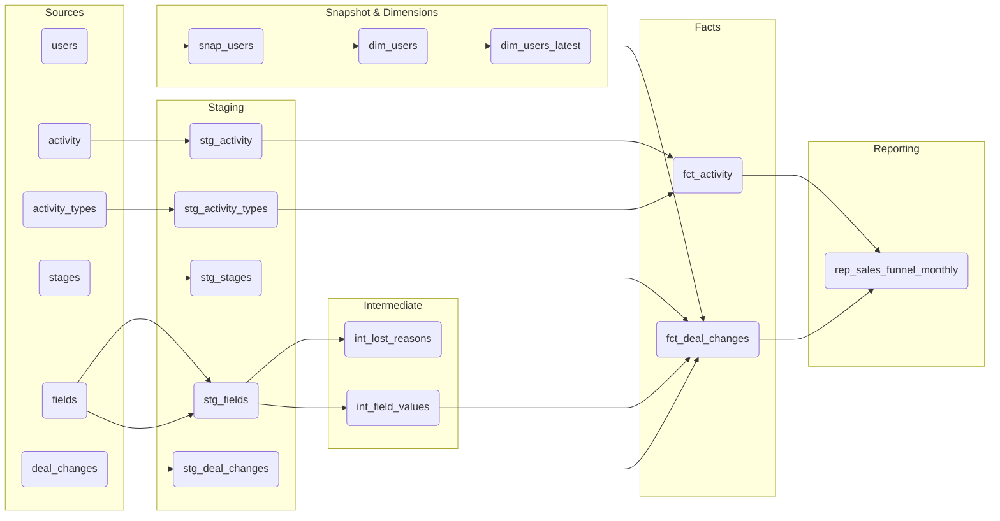

# Sales Funnel Analytics - dbt Project

## Overview

This project models raw Pipedrive CRM data into a clean, layered analytical pipeline
culminating in a monthly sales funnel reporting model. The goal is to track deal
progression through the sales pipeline and measure the volume of deals touching
each funnel step on a monthly basis.

---

## Data Sources

All raw data originates from Pipedrive CRM and is loaded into Postgres via a data
pipeline. Six source tables are available:

### `users`
The sales team members registered in Pipedrive. Each user has a name, email address,
and a `modified` timestamp reflecting the last time their record was updated. Users
are the human dimension of the pipeline - every deal has an owner, every activity is
assigned to a user.

### `stages`
A reference table defining the nine ordered pipeline stages a deal can move through,
from Lead Generation all the way to Renewal/Expansion. Maps a numeric `stage_id` to
a human-readable `stage_name`.

### `activity_types`
A reference table defining the types of sales activities available in Pipedrive.
Maps an internal type slug (e.g. `meeting`, `sc_2`) to a human-readable name
(e.g. `Sales Call 1`, `Sales Call 2`). Includes an `active` flag to distinguish
currently used types from retired ones.

### `activity`
The log of every sales activity created in Pipedrive. Each row is a discrete
interaction - a call made, a meeting held - linked to a specific deal and assigned
to a specific user. Includes a `done` flag indicating whether the activity was
completed and a `due_to` timestamp.

### `deal_changes`
The most critical source table. An immutable event log recording every field change
on every deal. Each row captures a single mutation - which deal changed, when, which
field changed, and what the new value is. Field changes include stage transitions
(`stage_id`), owner reassignments (`user_id`), deal creation (`add_time`), and lost
reason assignments (`lost_reason`). Deal history and stage progression are fully
reconstructed from this table.

### `fields`
Metadata table describing the deal fields tracked in Pipedrive. For fields with a
fixed set of options (stage, lost reason), stores the full option set as a JSON blob
mapping IDs to human-readable labels. Primary use in this project is resolving lost
reason IDs to labels via JSON parsing.

---

## Expected Output

The primary output of this project is `rep_sales_funnel_monthly` - a reporting table
with four columns:

| Column | Description |
|---|---|
| `activity_month` | First day of the month in which the funnel activity occurred |
| `kpi_name` | Human-readable name of the funnel step (e.g. Lead Generation, Sales Call 1) |
| `funnel_step` | Structured position identifier in the funnel (e.g. Step 1, Step 2.1) |
| `deals_count` | Number of distinct deals that touched this funnel step in the given month |

The model covers eleven funnel steps combining stage transition events and completed
sales call activities:

| Funnel Step | KPI Name | Source |
|---|---|---|
| Step 1 | Lead Generation | Stage transition |
| Step 2 | Qualified Lead | Stage transition |
| Step 2.1 | Sales Call 1 | Completed meeting activity |
| Step 3 | Needs Assessment | Stage transition |
| Step 3.1 | Sales Call 2 | Completed Sales Call 2 activity |
| Step 4 | Proposal/Quote Preparation | Stage transition |
| Step 5 | Negotiation | Stage transition |
| Step 6 | Closing | Stage transition |
| Step 7 | Implementation/Onboarding | Stage transition |
| Step 8 | Follow-up/Customer Success | Stage transition |
| Step 9 | Renewal/Expansion | Stage transition |

---

## Assumptions

### No duplicate records
Source data from Pipedrive is assumed to be free of duplicates. Pipedrive is a managed
SaaS CRM with system-generated unique IDs for all entities. Any duplicate records
appearing in the raw tables are treated as pipeline replication artifacts and are
expected to be handled upstream. No deduplication logic is applied within this project.

### Stable reference data
The following reference tables are assumed to be stable and not subject to meaningful
change:

- **`stages`** - stage IDs and names are assumed to be fixed. A change to a stage name
  or the addition of a new stage would require a review of the funnel step mappings in
  `rep_sales_funnel_monthly`.
- **`activity_types`** - the internal type slugs (`meeting`, `sc_2`) used to identify
  Sales Call 1 and Sales Call 2 are assumed to remain constant. Changes to these slugs
  would break the activity funnel step mapping.
- **`fields`** - the lost reason option set stored as a JSON blob is assumed to reflect
  the complete and current set of lost reasons.

### Completed activities only
Only activities with `done = true` are counted as funnel events. Scheduled but
incomplete activities are excluded from the funnel.

### Immutable deal changes
Records in `deal_changes` are assumed to be immutable once written. No updates or
deletions are expected on historical change events.

### Duplicate activity IDs
During exploration, duplicate `activity_id` values were identified in the source `activity`
table with differing field values across records. Specifically, 11 activity IDs were found
to appear more than once with different values across all columns. The root cause is unclear
without deeper knowledge of the Pipedrive data model and pipeline behaviour. In a real-world
scenario, this would be escalated to a stakeholder or a Pipedrive domain expert to determine
the correct deduplication strategy before applying any logic in the models. For the purpose
of this assessment, the data is kept as is.

---

## Lineage

---

## Modeling Choices

### Staging Layer

All staging models are materialised as **views**. Staging is a clean, 1-1
representation of the source - no business logic, no filtering, no aggregations.
The only transformations applied are column aliases where needed:

- When the original column name is a reserved SQL keyword (e.g. `type` → `activity_type_key`, `name` → `user_name`)
- When the original column name is ambiguous or unclear (e.g. `changed_field_key` kept as is since it is already descriptive)

Views are the correct materialisation for staging - they add no storage cost, always
reflect the current state of the source, and exist purely as a clean entry point into
the transformation pipeline.

The following staging models were created:

- **`stg_activity`** - raw activity log with `type` aliased to `activity_type_key` to
  avoid the reserved keyword conflict and to make the foreign key relationship explicit.
  Schema tests: `not_null` on all columns.
- **`stg_activity_types`** - reference table mapping activity type slugs to human-readable
  names. Columns renamed for clarity. Schema tests: `unique` and `not_null` on
  `activity_type_id` and `activity_type_key`, `not_null` on remaining columns.
- **`stg_deal_changes`** - raw deal change event log. No aliases applied - all source
  column names are already descriptive and non-reserved. Schema tests: `not_null` on
  all columns. No `unique` test since multiple change events exist per deal.
- **`stg_stages`** - reference table mapping stage IDs to stage names. Schema tests:
  `unique` and `not_null` on `stage_id`, `not_null` on `stage_name`.
- **`stg_fields`** - field metadata table. Filters rows where `field_value_options` is
  null as those carry no option set and are not used downstream. Schema tests: `unique`
  and `not_null` on `field_id` and `field_key`, `not_null` on remaining columns.

---

### Snapshot and Dimension Layer - Users

Users are the only entity in this project that changes meaningfully over time. A sales
rep can change their name or email, and those changes matter for historical attribution.
A three-layer approach was taken:

**`snap_users`** - a dbt snapshot using the `check` strategy watching `name` and `email`.
Every time either column changes, the snapshot closes the previous version and opens a
new one with the current timestamp. This implements **Slowly Changing Dimension Type 2
(SCD2)** - a historisation technique where changes to a record are never overwritten.
Instead, the old version is closed with an end timestamp and a new version is inserted,
preserving the full history of every change. This means multiple rows can exist for the
same user, each representing a distinct version of their record over time.
`hard_deletes = 'invalidate'` ensures that users deleted from Pipedrive are marked as
deleted rather than silently retained as active records. The `check` strategy was chosen
over `timestamp` because it compares actual column values directly, making it robust
against cases where the `modified` timestamp is not reliably updated in the source.
Schema tests: `unique` and `not_null` on `dbt_scd_id`, `not_null` on all remaining
columns.

**`dim_users`** - the full SCD2 history table built on top of the snapshot. Every version
of every user is preserved as a separate row. Exposes `dbt_scd_id`, `dbt_valid_from`,
`dbt_valid_to`, and `is_current` for point-in-time joins and history analysis. 
Materialised as a **table** since it holds historical data that grows over
time and is queried frequently. Schema tests: `unique` and `not_null` on `dbt_scd_id`,
`not_null` on all columns except `dbt_valid_to` which is null for the current version
of each record.

**`dim_users_latest`** - a **view** filtering `dim_users` to `is_current = true`. Exposes
only the four business columns (`user_id`, `user_name`, `email`, `modified`) with no
dbt metadata. This is the model intended for end-user consumption and downstream joins
where only current user state is needed. Schema tests: `unique` and `not_null` on
`user_id`, `not_null` on all remaining columns.

---

### Intermediate Layer

**`int_lost_reasons`** - the `fields` table stores lost reason options as a JSON blob
rather than a dedicated reference table. This intermediate model parses that blob using
`jsonb_array_elements` and unnests it into a clean lookup table with one row per lost
reason option. Materialised as a **view** since it is a lightweight transformation with
no storage justification. Schema tests: `unique` and `not_null` on `lost_reason_id`
and `lost_reason_label`.

**`int_field_values`** - a generalised extension of the lost reasons approach. Rather
than parsing only lost reasons, this model unpacks all field option sets from `stg_fields`
into a single unified lookup table keyed on `field_key` and `value_id`. This allows
`fct_deal_changes` to resolve any option-based field value to a human-readable label
via a single dynamic join, rather than maintaining one hardcoded join per field type.
Any new option-based fields added in Pipedrive are automatically captured without
requiring model changes. Materialised as a **view**. Schema tests: `not_null` on all
columns. No `unique` test on `value_id` alone since the same ID can exist across
different field keys.

---

### Fact Layer

**`fct_activity`** - each row is a discrete sales activity event. Materialised as an
**incremental table** using the **append** strategy. Append was chosen because Pipedrive
guarantees unique activity IDs and each version of an activity record is treated as a
valid event worth preserving rather than an update to be overwritten. Joins
`stg_activity_types` to resolve the activity type slug to a human-readable name and
active status. The incremental filter uses `>` on `due_to` since timestamps are precise
enough to avoid boundary collisions. In a BigQuery environment this model would be
partitioned by `due_to` and clustered by `deal_id` for query performance. Schema tests:
`not_null` on all columns.

**`fct_deal_changes`** - each row is an immutable field change event on a deal.
Materialised as an **incremental table** using the **append** strategy. Append is the
correct choice because deal change events are immutable once recorded - they are never
updated or deleted in Pipedrive. Two joins enrich the raw event log:

- A dynamic join to `int_field_values` resolves all option-based field values
  (stage names, lost reason labels, and any future option fields) to human-readable
  labels via a single join condition on `changed_field_key` and `new_value`.
- A conditional join to `dim_users_latest` resolves user ID changes to user names,
  applied only when `changed_field_key = 'user_id'`.

The incremental filter uses `>` on `change_time` since timestamps are precise enough
to avoid boundary collisions. In a BigQuery environment this model would be partitioned
by `change_time` and clustered by `deal_id` for query performance. Schema tests:
`not_null` on `deal_id`, `change_time`, `changed_field_key`, and `new_value`. No
`not_null` on `resolved_value` or `user_name` since only one is populated per row
depending on `changed_field_key`.

---

### Reporting Layer

**`rep_sales_funnel_monthly`** - the primary output of this project. Materialised as a
**table** since it is the end consumption layer, queried frequently by dashboards and
business users. A full rebuild on every run is acceptable given the aggregated and
relatively small size of the output.

The model combines two sources into a unified funnel view using `union all`:

- **`stage_funnel`** - pulls stage transition events from `fct_deal_changes`, filtering
  on `changed_field_key = 'stage_id'`. Groups by month and stage, counting distinct
  deals that entered each stage. The `resolved_value` column already carries the
  human-readable stage name from the upstream fact model. Stage IDs are mapped to
  structured funnel step labels via a `case` statement on `new_value`.

- **`activity_funnel`** - pulls completed Sales Call 1 and Sales Call 2 activities from
  `fct_activity`, filtering on `activity_type_key in ('meeting', 'sc_2')`, `done is true`,
  and `is_activity_type_active is true`. Groups by month and activity type, counting
  distinct deals that had each call completed. Activity type keys are mapped to their
  funnel step positions (`Step 2.1`, `Step 3.1`) via a `case` statement.

`union all` is used rather than `union` because rows from `stage_funnel` and
`activity_funnel` are by definition distinct - they originate from different source
tables representing different types of funnel events. `union` would add an unnecessary
and costly deduplication pass over the result set.

The final result is ordered by `activity_month` and `funnel_step` to produce a clean
chronological waterfall view of the funnel.

Schema tests: `not_null` on all four columns - `activity_month`, `kpi_name`,
`funnel_step`, and `deals_count`. No `unique` test since the combination of month
and funnel step is what identifies a row, and uniqueness is guaranteed by the
`group by` in each CTE rather than by a single column constraint.

---

## Models Exposed to End Users

The following models are intended for direct consumption by business users, analysts,
and BI tools:

### `dim_users_latest`
The current state of all active sales reps. Useful for filtering and grouping reports
by rep name or email without needing to understand the underlying snapshot or SCD2
history. A clean, metadata-free view with only the four business columns that matter.

### `fct_activity`
The complete log of all sales activities. Useful for analysing rep activity levels,
tracking call completion rates, identifying deals with no recent activity, and building
rep performance dashboards. Any question of the form "how many calls did rep X make in
month Y" is answerable directly from this table.

### `fct_deal_changes`
The full deal lifecycle history. Useful for point-in-time analysis - understanding
where a deal stood at any given moment, how long it spent in each stage, which deals
were lost and why, and how ownership changed over time. Any question about deal
progression or history is answerable from this table.

### `rep_sales_funnel_monthly`
The primary reporting output. Pre-aggregated and shaped for direct consumption by
dashboards and business users. A BI tool connects to this table and renders it as a
funnel chart or waterfall with no additional transformation needed. This is the model
most sales managers and leadership will interact with on a day to day basis.

---

`dim_users` and the snapshot `snap_users` are intentionally not exposed to end users.
They carry dbt metadata columns and SCD2 history that are relevant for engineering
and point-in-time joins but not for general business consumption. `dim_users_latest`
serves as the clean interface for all end-user needs.

---

## A Note on AI Usage

This project was developed with the assistance of Claude (Anthropic). All data modeling
decisions were my own - including the choice of incremental strategies, materialization
types, layer structure, schema tests, and whether column aliases were necessary or not.
Claude was used as a technical sounding board to discuss best practices, write clean and
consistent SQL, produce thorough schema.yml descriptions, and refine code quality
through back and forth discussion. The analytical thinking, architectural decisions, and
modeling choices behind this project are entirely mine.

This README was also written with the assistance of Claude to ensure clear structure
and neat formatting. The content and decisions described within it are my own.